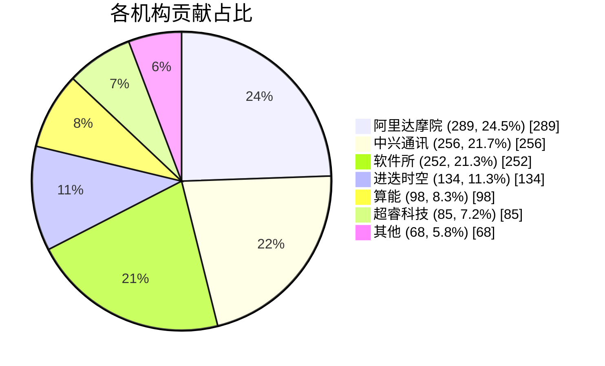

# 📊 内核贡献统计报告

**最后更新时间**: 2026-03-09 21:51:52
**主分支**: `tmp-stats`
**主分支提交**: 3c705a33
**统计起始点**: `v6.6.127`

---

## 总体统计

| 项目 | 数量 |
|------|------|
| 总提交数 | 1182 |
| 有机构贡献的提交 | 1114 |
| 无机构贡献的提交 | 68 |

### 📌 累计贡献概览

目前 RVCK 基于统计起始点 `v6.6.127`，已累计合入 1182 个补丁（截至 2026-03-09），其中，阿里达摩院 289 个提交 (24.5%)，中兴通讯 256 个提交 (21.7%)，软件所 252 个提交 (21.3%)，进迭时空 134 个提交 (11.3%)，算能 98 个提交 (8.3%)，超睿科技 85 个提交 (7.2%)。

### 📊 代码修改统计

RVCK 累计合入的补丁涉及代码修改：insert 🟢 +1677195 delete 🔴 -48186

### 📁 补丁分类统计

| 类别 | 数量 | 说明 |
|------|------|------|
| feature | 1005 | 新功能 |
| bugfix | 169 | 缺陷修复 |
| backport | 597 | 主线反合 |
| hardware support | 342 | 硬件支持 |

> 💡 **说明**: 分类标签存在交叉，同一提交可能同时属于多个分类（如 feature+backport+hardware）。
> 因此各分类数量之和可能大于总提交数。

**硬件平台分布**:
- th1520: 193
- k1: 75
- dp1000: 39
- sg2042: 13
- k3: 11
- p1: 6
- sg2044: 5

### 📊 各机构贡献分类矩阵

| 机构 | 新功能 | 缺陷修复 | 代码清理 | 配置变更 | 其他 | backport | hardware | 总计 |
|------|--------|--------|--------|--------|--------|----------|----------|------|
| 超睿科技 | 76 | 9 | 0 | 0 | 0 | 36 | 40 | 85 |
| 进迭时空 | 120 | 14 | 0 | 0 | 0 | 26 | 92 | 134 |
| 中兴通讯 | 201 | 53 | 0 | 2 | 0 | 234 | 0 | 256 |
| 阿里达摩院 | 250 | 39 | 0 | 0 | 0 | 123 | 104 | 289 |
| 算能 | 90 | 8 | 0 | 0 | 0 | 45 | 17 | 98 |
| 软件所 | 202 | 44 | 5 | 0 | 1 | 133 | 57 | 252 |

> 💡 **说明**: 分类标签存在交叉，同一提交可能同时属于多个分类（如 feature+backport+hardware）。
> 因此各分类数字之和可能大于"总计"列。

### 🏆 各分类贡献排行

#### 🚀 新功能 (Top 3)

| 排名 | 机构 | 数量 | 占比 |
|------|------|------|------|
| 🥇 | 阿里达摩院 | 250 | 24.9% |
| 🥈 | 软件所 | 202 | 20.1% |
| 🥉 | 中兴通讯 | 201 | 20.0% |

#### 🐛 缺陷修复 (Top 3)

| 排名 | 机构 | 数量 | 占比 |
|------|------|------|------|
| 🥇 | 中兴通讯 | 53 | 31.4% |
| 🥈 | 软件所 | 44 | 26.0% |
| 🥉 | 阿里达摩院 | 39 | 23.1% |

#### 🧹 代码清理 (Top 3)

| 排名 | 机构 | 数量 | 占比 |
|------|------|------|------|
| 🥇 | 软件所 | 5 | 100.0% |

#### ⚙️ 配置变更 (Top 3)

| 排名 | 机构 | 数量 | 占比 |
|------|------|------|------|
| 🥇 | 中兴通讯 | 2 | 100.0% |

#### 📝 其他贡献 (Top 3)

| 排名 | 机构 | 数量 | 占比 |
|------|------|------|------|
| 🥇 | 软件所 | 1 | 100.0% |

#### 🔄 Backport (主线反合)

| 排名 | 机构 | 数量 | 占比 |
|------|------|------|------|
| 🥇 | 中兴通讯 | 234 | 39.2% |
| 🥈 | 软件所 | 133 | 22.3% |
| 🥉 | 阿里达摩院 | 123 | 20.6% |

#### 🔧 Hardware Support (硬件支持)

| 排名 | 机构 | 数量 | 占比 |
|------|------|------|------|
| 🥇 | 阿里达摩院 | 104 | 30.4% |
| 🥈 | 进迭时空 | 92 | 26.9% |
| 🥉 | 软件所 | 57 | 16.7% |

### 📊 GitHub 仓库统计

| 项目 | 数量 |
|------|------|
| Open Issues | 90 |
| Closed Issues | 63 |
| Open PRs | 2 |
| Closed PRs | 74 |

## 各机构贡献统计

| 机构 | 提交数 | 占比 | 可视化占比 | 代码修改行数 |
|------|--------|------|------------|--------------|
| [阿里达摩院](companies/阿里达摩院.md) | 289 | 24.5% | `████████████░░░░░░░░░░░░░░░░░░░░░░░░░░░░░░░░░░░░░░` | +61030/-7731 (68761) |
| [中兴通讯](companies/中兴通讯.md) | 256 | 21.7% | `██████████░░░░░░░░░░░░░░░░░░░░░░░░░░░░░░░░░░░░░░░░` | +20583/-2766 (23349) |
| [软件所](companies/软件所.md) | 252 | 21.3% | `██████████░░░░░░░░░░░░░░░░░░░░░░░░░░░░░░░░░░░░░░░░` | +1399723/-10436 (1410159) |
| [进迭时空](companies/进迭时空.md) | 134 | 11.3% | `█████░░░░░░░░░░░░░░░░░░░░░░░░░░░░░░░░░░░░░░░░░░░░░` | +44848/-9982 (54830) |
| [算能](companies/算能.md) | 98 | 8.3% | `████░░░░░░░░░░░░░░░░░░░░░░░░░░░░░░░░░░░░░░░░░░░░░░` | +31569/-1016 (32585) |
| [超睿科技](companies/超睿科技.md) | 85 | 7.2% | `███░░░░░░░░░░░░░░░░░░░░░░░░░░░░░░░░░░░░░░░░░░░░░░░` | +10312/-779 (11091) |

## 📈 可视化图表

## 📋 统计规则说明

### 1. 机构识别规则
- **超睿科技**: @ultrarisc.com
- **进迭时空**: @spacemit.com, @linux.spacemit.com
- **中兴通讯**: @zte.com.cn
- **阿里达摩院**: @linux.alibaba.com
- **算能**: @sophgo.com
- **软件所**: @iscas.ac.cn, @isrc.iscas.ac.cn，特定签名：Weihao Li <ieiao@outlook.com>

### 2. 提交归属规则

贡献统计目前只面向对 RVCK 仓库有贡献的参与机构，因此在对主线补丁反合至 RVCK
等工作中，原补丁作者所属机构暂不计入该统计。

在 RVCK 贡献机构范围中，提交归属统计基于以下规则：

1. **优先原则**: 如果提交的 Author 邮箱属于某机构，则该提交只计入该机构
2. **签名统计**: 如果 Author 不属于任何机构，则统计签名中出现的所有机构
3. **去重规则**: 每个提交对每个机构最多计1次

### 3. 统计范围
- 主分支: `tmp-stats`
- 起始点: v6.6.127
- 结束点: 统计时的最新提交

---

## 🔧 技术说明

- **统计分支**: `contrib-stats`
- **统计脚本**: [scripts/contrib_stats/](scripts/contrib_stats/)
- **更新方式**: 手动/定时触发，脚本更新时自动触发
- **原始数据**: [data/latest.json](data/latest.json)

---

*最后更新: 2026-03-09 21:51:52*
*生成自主分支提交: 3c705a33*
